## High-Level Shape

The app is a Next.js App Router application with React, TypeScript, Tailwind CSS, Vitest, Playwright, and Storybook.

The app now has a Supabase project collaboration schema for persisted project
ownership, membership, invites, files, phase-keyed state, and activity. The
current UI still uses browser storage for Phase 1 workflow state until the
server repository work connects the app to these tables.

## Runtime Layers

| Layer                 | Main Files                       | Simple Explanation                                           |
| --------------------- | -------------------------------- | ------------------------------------------------------------ |
| App routes            | `src/app/`                       | Pages, layouts, and API routes                               |
| Phase 1 UI            | `src/components/phase1/`         | Project home, shell, topbar, and workflow studios            |
| Phase 1 state         | `src/lib/phase1/`                | Project registry, workflow rules, fixtures                   |
| Requirements pipeline | `src/lib/requirements/`          | Excel parsing, generation, review, validation, script export |
| Server generation     | `src/lib/requirements/server/`   | Config, MCP client, Bedrock client, real provider            |
| Supabase foundation   | `src/lib/supabase/`, `supabase/` | Auth clients, session middleware, config checks, migrations  |
| QA                    | `src/**/*.test.ts`, `tests/e2e/` | Unit, surface, API, and browser checks                       |

## Main Routes

| Route                                       | File                                                        | Purpose                                              |
| ------------------------------------------- | ----------------------------------------------------------- | ---------------------------------------------------- |
| `/`                                         | `src/app/page.tsx`                                          | Project home with fixture-backed initial state       |
| `/projects/[projectId]`                     | `src/app/projects/[projectId]/page.tsx`                     | Redirects to the current or recommended project step |
| `/projects/[projectId]/source`              | `src/app/projects/[projectId]/source/page.tsx`              | Workbook confirmation and upload                     |
| `/projects/[projectId]/generate`            | `src/app/projects/[projectId]/generate/page.tsx`            | Draft generation workspace                           |
| `/projects/[projectId]/review`              | `src/app/projects/[projectId]/review/page.tsx`              | Consultant review queue                              |
| `/projects/[projectId]/script`              | `src/app/projects/[projectId]/script/page.tsx`              | Demo script editor                                   |
| `/projects/[projectId]/export`              | `src/app/projects/[projectId]/export/page.tsx`              | Markdown handoff export                              |
| `/docs`                                     | `src/app/docs/[[...slug]]/page.tsx`                         | This onboarding docs site                            |
| `/api/requirements/generate`                | `src/app/api/requirements/generate/route.ts`                | Server boundary for mock or real draft generation    |
| `/api/requirements/generation-availability` | `src/app/api/requirements/generation-availability/route.ts` | Generation mode and real-provider availability       |
| `/api/search`                               | `src/app/api/search/route.ts`                               | Fumadocs search endpoint                             |

Legacy `setup` and `handoff` project pages still exist as redirects for older links.

## Route Layout Ownership

`src/app/projects/[projectId]/layout.tsx` wraps project pages in `Phase1ProjectProvider`.

That provider receives fixture fallback state from `src/lib/phase1/fixture.ts`, resolves the route `projectId`, and gives every step page access to the same local project state.

## State Model

The state model has two related pieces:

- workbook/review state in `src/lib/requirements/workspace-state.ts`
- project registry state in `src/lib/phase1/project-registry.ts`
- persisted project collaboration state in Supabase migrations under
  `supabase/migrations/`

The project registry stores local Phase 1 records under the browser key:

```text
cm-mes-advisor:phase1-project-registry:v3
```

Review state and active source data also use browser storage keys. Storage failures should not crash the UI; the code catches storage errors and falls back to in-memory behavior where possible.

Supabase persistence is intentionally project-scoped. See
[Project Collaboration Schema](/docs/project-collaboration-schema) for the
tables, roles, and RLS contract that future repository code should use.

## Main Data Flow

```mermaid
flowchart LR
  Workbook["Excel workbook"] --> Parser["parser-node.ts / parser.ts"]
  Parser --> Workspace["Workspace state"]
  Workspace --> Generate["/api/requirements/generate"]
  Generate --> Drafts["Generated drafts"]
  Drafts --> Review["Review state"]
  Review --> Approved["Approved rows"]
  Approved --> Script["Demo script assembly"]
  Script --> Export["Markdown export"]
```



## Client And Server Boundary

Client components own the review workspace, local project state, uploads, filtering, editing, and routing UX.

Server-only files own:

- reading the committed fixture from disk
- generation provider selection
- MCP document lookup
- Bedrock calls
- generation availability checks
- environment variable validation
- Supabase config checks for future server repositories

Never move AWS, Bedrock, MCP, MES, Supabase service-role, or partner secrets into
client components.

## Old Shared Components

`src/app/requirements-review-workspace.tsx` is a large older/shared component. The current routed studios still reuse exported pieces from it, including source panels, requirement explorers, and guided review pieces.

`src/app/demo-script-panel.tsx` owns the document-style script editing and export UI used by the current script and export studios.

Treat these files with care because small changes can affect multiple routed screens.
